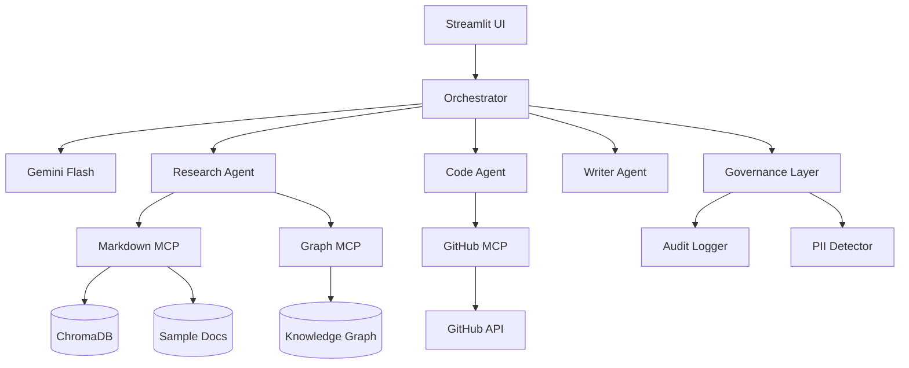

##  Live Demo

[Launch the Enterprise Knowledge Orchestrator](https://enterprise-orchestrator-mcp-rz3hd3jvxeumfm2dw7yxuv.streamlit.app)

[](https://github.com/thanya0802/enterprise-orchestrator-mcp/actions/workflows/tests.yml)

# Enterprise Knowledge Orchestrator

> Ask natural language questions across your enterprise tools — docs, GitHub, PDFs — and get synthesized answers with citations powered by a knowledge graph.

## Architecture



## Technologies

- **MCP** — 4 servers connecting to markdown docs, GitHub, knowledge graph, and multimodal assets
- **GraphRAG** — Knowledge graph + vector search for multi-hop reasoning
- **A2A Protocol** — Specialized agents with HTTP agent cards (`/.well-known/agent.json`)
- **Multimodal** — PDF and image analysis via Gemini Flash
- **AI Governance** — Full audit trail, PII detection, compliance reporting

## Quick Start

### Prerequisites

- Python 3.11+
- [uv](https://docs.astral.sh/uv/) package manager
- Gemini API key ([aistudio.google.com](https://aistudio.google.com))
- GitHub token (optional, for PR/issue queries)

### Setup

```bash
# Install dependencies
uv sync

# Sync MCP server dependencies
uv sync --directory mcp-servers/markdown-server
uv sync --directory mcp-servers/github-server
uv sync --directory mcp-servers/graph-server

# Configure environment
cp .env.example .env
# Edit .env with your GOOGLE_API_KEY, GITHUB_TOKEN, GITHUB_REPO

# Run tests
uv run pytest

# Run the Streamlit UI
uv run streamlit run app/main.py
```

### Docker

```bash
docker compose up --build
# UI at http://localhost:8501
```

### MCP Inspector (test servers individually)

```bash
cd mcp-servers/markdown-server
DOCS_DIR=./sample-docs npx @modelcontextprotocol/inspector uv run server.py

cd mcp-servers/github-server
GITHUB_TOKEN=xxx GITHUB_REPO=owner/repo npx @modelcontextprotocol/inspector uv run server.py
```

## Example Queries

- "What decisions were made about the auth refactor last month?"
- "What does the security review say is blocking PR #51?" (tests grounding against the seeded sample docs — PR #51 is fictional demo data, not a real PR on the configured `GITHUB_REPO`)
- "Summarize the architecture decisions and flag any that conflict with open PRs" (cross-references docs with whatever is actually open on the configured `GITHUB_REPO`)
- "Who made the decision about the auth refactor, and what PRs are they working on?"
- "What are the open issues right now?" (live GitHub data — reflects the real repo, not the sample docs)

## Project Structure

```
├── mcp-servers/          # MCP tool servers: markdown, github, graph, multimodal
├── graph_rag/            # Entity extraction, knowledge graph, ingest pipeline
├── agents/               # Orchestrator + research/code/writer agents + A2A
├── governance/           # Audit logging, PII detection, compliance reports
├── app/                  # Streamlit UI
├── tests/
├── .github/workflows/    # CI: runs pytest on every push
├── docker-compose.yml
└── knowledge_graph.json  # Pre-seeded graph from sample docs
```

## Modes

**Single orchestrator** — LLM plans tool calls across all MCP servers and synthesizes an answer.

**Multi-agent** — Decomposes complex questions across research, code, and writer agents with full audit trail.

Set `USE_MULTI_AGENT=true` for CLI multi-agent mode:

```bash
USE_MULTI_AGENT=true uv run python agents/orchestrator.py
```

## Rebuild Knowledge Graph

With `GOOGLE_API_KEY` set, extract entities from docs via LLM:

```bash
uv run python graph_rag/ingest.py
```

## Design Decisions

| Choice | Why |
|--------|-----|
| FastMCP | Official MCP SDK, minimal boilerplate, decorator-based tools |
| ChromaDB | Local vector store, zero config, good for demos |
| NetworkX | Lightweight graph for local dev; swap to Neo4j for production |
| Gemini Flash | Best free tier for planning + synthesis |
| Streamlit | Fast demo UI without frontend expertise |
| uv | Modern Python tooling, matches MCP docs |

## Limitations & Future Work

- GitHub server requires a token for private repos and higher rate limits
- Entity extraction quality depends on the LLM; a pre-seeded graph is provided for offline demo
- PII detection uses regex patterns (email, phone, SSN, credit card) — good enough to demonstrate the governance pattern, but not a substitute for a production NER-based tool like Microsoft Presidio
- Roadmap: Confluence and Google Drive MCP servers (Phase 2), Presidio-based PII detection (Phase 2), Neo4j AuraDB backing for the knowledge graph at production scale (Phase 3) — NetworkX is the right choice for this demo's data volume but doesn't horizontally scale
- Test coverage focuses on the knowledge graph and governance modules plus MCP client failure handling; end-to-end agent orchestration is validated manually via the demo link above rather than in CI, since it requires a live Gemini API key
- `GEMINI_MODEL` defaults to a specific model string (currently `gemini-3.6-flash`) rather than a rolling alias like `gemini-flash-latest` — Google has a multi-cutover deprecation cadence (2.0 → 2.5 → 3.x flash generations shipped within the same year), so this default will need bumping periodically. Override via the `GEMINI_MODEL` env var without touching code.
- The sample docs (auth refactor, PR numbers, engineering syncs) are self-contained fictional demo data, unrelated to whatever real repo is configured via `GITHUB_REPO`. Questions referencing specific PR numbers from the docs (e.g. PR #51) won't resolve against live GitHub — that's the retrieval correctly refusing to hallucinate a match, not a bug. Questions about live repo state ("what are the open issues right now") query the real, separate `GITHUB_REPO`.

## License

MIT
