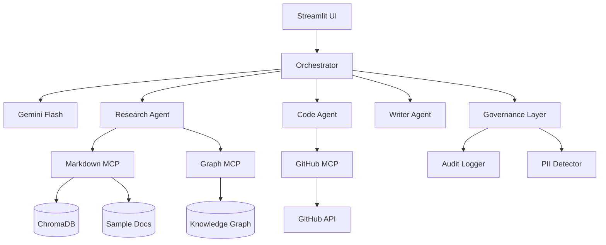

# Enterprise Knowledge Orchestrator

> Ask natural language questions across your enterprise tools — docs, GitHub, PDFs — and get synthesized answers with citations powered by a knowledge graph.

## Architecture



## Technologies

- **MCP** — 4 servers connecting to markdown docs, GitHub, knowledge graph, and multimodal assets
- **GraphRAG** — Knowledge graph + vector search for multi-hop reasoning
- **A2A Protocol** — Specialized agents with HTTP agent cards (`/.well-known/agent.json`)
- **Multimodal** — PDF and image analysis via Gemini Flash
- **AI Governance** — Full audit trail, PII detection, compliance reporting

## Quick Start

### Prerequisites

- Python 3.11+
- [uv](https://docs.astral.sh/uv/) package manager
- Gemini API key ([aistudio.google.com](https://aistudio.google.com))
- GitHub token (optional, for PR/issue queries)

### Setup

```bash
# Install dependencies
uv sync

# Sync MCP server dependencies
uv sync --directory mcp-servers/markdown-server
uv sync --directory mcp-servers/github-server
uv sync --directory mcp-servers/graph-server

# Configure environment
cp .env.example .env
# Edit .env with your GOOGLE_API_KEY, GITHUB_TOKEN, GITHUB_REPO

# Run tests
uv run pytest

# Run the Streamlit UI
uv run streamlit run app/main.py
```

### Docker

```bash
docker compose up --build
# UI at http://localhost:8501
```

### MCP Inspector (test servers individually)

```bash
cd mcp-servers/markdown-server
DOCS_DIR=./sample-docs npx @modelcontextprotocol/inspector uv run server.py

cd mcp-servers/github-server
GITHUB_TOKEN=xxx GITHUB_REPO=owner/repo npx @modelcontextprotocol/inspector uv run server.py
```

## Example Queries

- "What decisions were made about the auth refactor last month?"
- "Who is responsible for PR #51 and what's blocking it?"
- "Summarize the architecture decisions and flag any that conflict with open PRs"
- "Who made the decision about the auth refactor, and what PRs are they working on?"

## Project Structure

```
├── mcp-servers/          # MCP tool servers (markdown, github, graph, multimodal)
├── graph_rag/            # Entity extraction, knowledge graph, ingest pipeline
├── agents/               # Orchestrator + research/code/writer agents + A2A
├── governance/           # Audit logging, PII detection, compliance reports
├── app/                  # Streamlit UI
├── tests/
├── docker-compose.yml
└── knowledge_graph.json  # Pre-seeded graph from sample docs
```

## Modes

**Single orchestrator** — LLM plans tool calls across all MCP servers and synthesizes an answer.

**Multi-agent** — Decomposes complex questions across research, code, and writer agents with full audit trail.

Set `USE_MULTI_AGENT=true` for CLI multi-agent mode:

```bash
USE_MULTI_AGENT=true uv run python agents/orchestrator.py
```

## Rebuild Knowledge Graph

With `GOOGLE_API_KEY` set, extract entities from docs via LLM:

```bash
uv run python graph_rag/ingest.py
```

## Design Decisions

| Choice | Why |
|--------|-----|
| FastMCP | Official MCP SDK, minimal boilerplate, decorator-based tools |
| ChromaDB | Local vector store, zero config, good for demos |
| NetworkX | Lightweight graph for local dev; swap to Neo4j for production |
| Gemini Flash | Best free tier for planning + synthesis |
| Streamlit | Fast demo UI without frontend expertise |
| uv | Modern Python tooling, matches MCP docs |

## Limitations & Future Work

- GitHub server requires token for private repos and higher rate limits
- Entity extraction quality depends on LLM; pre-seeded graph provided for offline demo
- Confluence and Google Drive servers are Phase 2/3 placeholders
- Presidio integration planned for production-grade PII detection
- Neo4j AuraDB option documented in build guide for production graphs

## License

MIT
